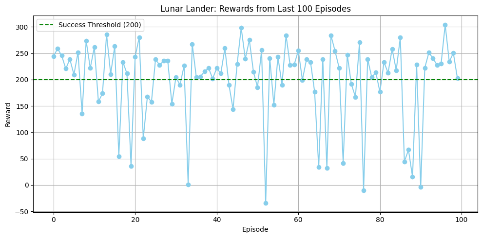

# lunar-lander-dqn

# 🛰️ Lunar Lander with Deep Q-Learning (DQN)

This project implements a reinforcement learning agent that learns to land a spacecraft safely using Deep Q-Learning (DQN). Built with PyTorch and OpenAI Gymnasium, the agent learns through trial-and-error and eventually lands with >80% success rate 🚀

## 📽️ Demo




## 🚀 Features
- From-scratch implementation of Deep Q-Network (DQN)
- Experience Replay Buffer and Target Networks
- Epsilon-Greedy Strategy with Decay
- Training visualization and success rate evaluation
- Google Colab-compatible (with GPU support)

## 🧠 Key Concepts
- Q-learning with function approximation
- Exploration vs. Exploitation (ε-greedy)
- Temporal Difference learning
- Stabilizing with Experience Replay & Target Networks

## 📦 Tech Stack

| Component     | Tool/Library        |
|---------------|---------------------|
| RL Algorithm  | Deep Q-Network (DQN)|
| Language      | Python              |
| Framework     | PyTorch             |
| Environment   | Gymnasium (`LunarLander-v3`) |
| Notebook Env  | Google Colab        |
| Visualization | Matplotlib, TensorBoard |

## 📁 Files

- `Lunar_Lander_DQN.ipynb` — Main training and evaluation notebook
- `learning_curve.png` - Learning Curve
- `demo_landing.mp4` - Demo Landing Video
- `requirements.txt` — Dependencies

## ⚙️ Installation

To run locally:

```bash
git clone https://github.com/yourusername/lunar-lander-dqn.git
cd lunar-lander-dqn
pip install -r requirements.txt
